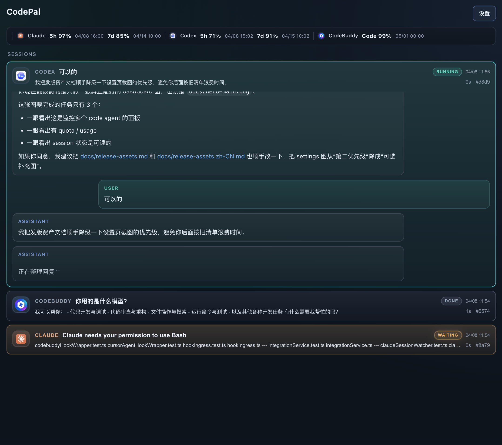

<h1 align="center">
  
  <span valign="middle">CodePal</span>
</h1>

<p align="center"><strong>一个面板，掌控所有 AI 编码代理 — 会话、活动、配额，始终在眼前。</strong></p>

<p align="center">
  
  
  
  
  <br/>
  <a href="https://github.com/shamcleren/CodePal/releases"><strong>前往 Releases 下载</strong></a>
  ·
  <a href="./README.md">English</a>
</p>

---

## 为什么是 CodePal

同时跑多个 AI 编码代理，注意力就会开始割裂：

- 一个会话正在 Cursor 里运行
- 另一个会话在终端里等待审批
- 配额和用量藏在浏览器页面里
- 最近活动分散在不同工具界面里

CodePal 把这一切收拢进一个始终悬浮在桌面上的面板。

## 界面预览



## 你能得到什么

- **统一 session 视图**：所有代理的活跃、等待、完成、异常会话汇聚在同一列表
- **聚焦的活动时间线**：看到每个代理在做什么 — 回复、工具调用、状态变化 — 去掉多余噪音
- **配额与用量感知**：token 用量和可用的限速信号保持可见，支持紧凑与详细两种密度切换
- **历史持久化**：完整活动历史本地存储，重启后也能随时回溯
- **一键修复接入**：直接在应用内修复受支持的本地代理配置
- **双语界面**：支持英文和简体中文，默认跟随系统语言

## 支持的 Agent

| Agent | Session | 用量 |
|:---|:---:|:---:|
| **Cursor** | ✅ | ✅ |
| **Claude Code** | ✅ | ✅ |
| **Codex** | ✅ | ✅ |
| **CodeBuddy** | ✅ | ✅ |
| **GoLand / PyCharm*** | ✅ | ✅ |

\* GoLand 和 PyCharm 走共享的 CodeBuddy JetBrains 插件路径。

## 安装

1. 打开 [Releases](https://github.com/shamcleren/CodePal/releases)。
2. 下载最新的 macOS `.dmg` 或 `.zip`。
3. 把 `CodePal.app` 移到 `Applications`。
4. 启动 — 已运行的代理会自动接入。

正式发布构建已经过 Apple 签名与公证，打开时不会出现安全拦截提示。

## 接下来

- **监控深度**：继续校准 Cursor、CodeBuddy、Claude Code 和 JetBrains 路径的真实 payload
- **发布可靠性**：保持已签名 / 已公证 macOS 版本和应用内更新发现稳定
- **产品打磨**：更清晰的 degraded 状态、更低噪音的 timeline，以及关键任务状态通知

更完整的规划方向见 [docs/roadmap-next.zh-CN.md](docs/roadmap-next.zh-CN.md)。

## 快速开始（开发）

```bash
git clone https://github.com/shamcleren/CodePal.git
cd CodePal
npm install
npm run dev        # 开发模式启动
npm run test       # 运行单元测试
npm run dist:mac   # 构建 .dmg / .zip（需要 Apple 签名凭据）
```

构建签名 / 公证版本前，需先设置 `APPLE_ID`、`APPLE_APP_SPECIFIC_PASSWORD` 和 `APPLE_TEAM_ID` 环境变量。

## 常见问题

**看不到 Session**
确认对应的 Agent（Cursor / Claude Code / Codex / CodeBuddy）确实有正在运行的会话。可以使用应用内诊断页检查集成路径是否正常。

## 隐私与支持

- [隐私与数据边界说明](docs/privacy-and-data.zh-CN.md)
- [支持范围说明](docs/support-scope.zh-CN.md)
- [常见问题与排查](docs/troubleshooting.zh-CN.md)
- [提交 Issue](https://github.com/shamcleren/CodePal/issues/new/choose)

## 开发者文档

<details>
<summary>内部文档入口</summary>

- [AGENTS.md](AGENTS.md) — Agent 编码约定
- [docs/design-overview.md](docs/design-overview.md) — 架构概览
- [docs/context/current-status.md](docs/context/current-status.md) — 当前状态
- [docs/README.md](docs/README.md) — 文档索引
- [design/codepal-icon-redesign](design/codepal-icon-redesign) — 新版应用图标和 macOS 菜单栏图标源稿

</details>

## License

MIT
