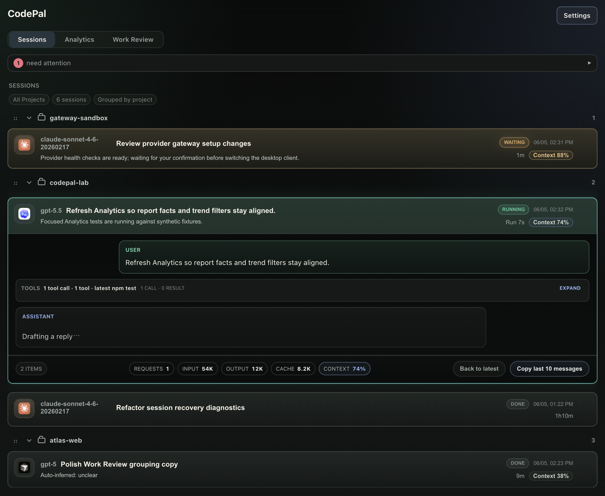
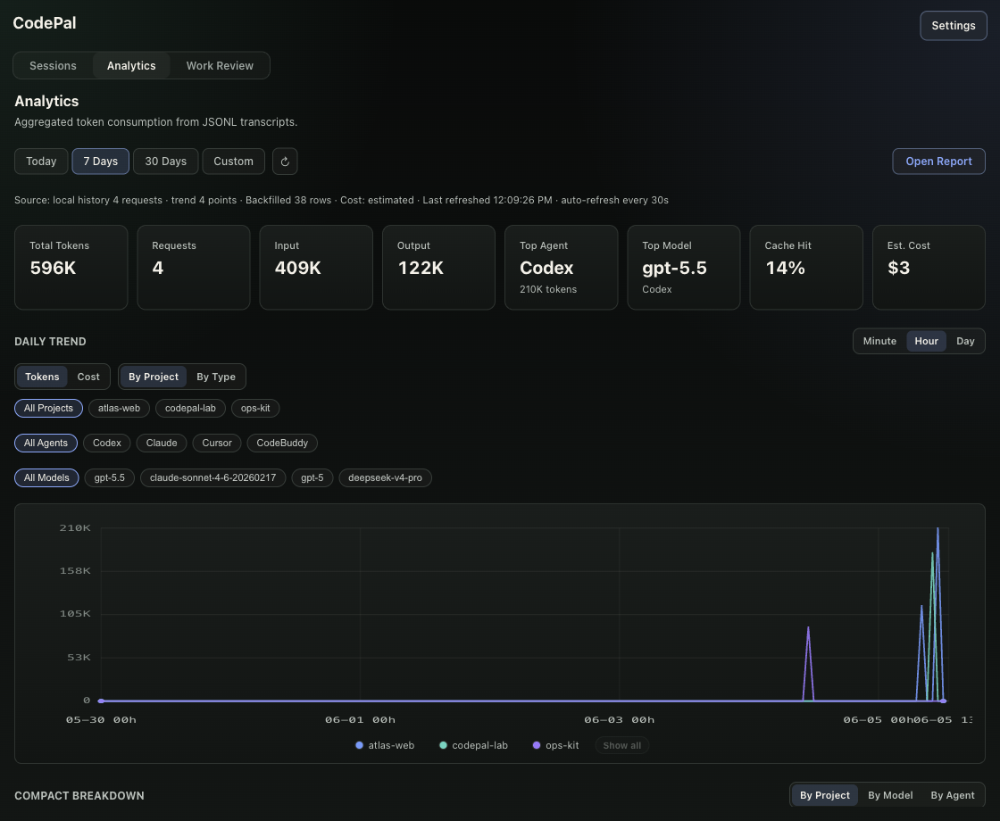
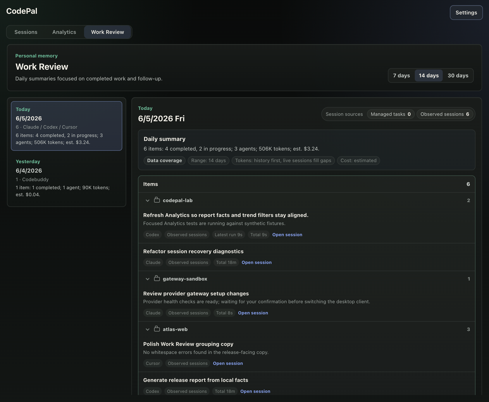

<h1 align="center">
  
  <span valign="middle">CodePal</span>
</h1>

<p align="center"><strong>重度 AI 编码用户的本地控制塔 — 会话、用量、工作回顾和诊断，都在一个 macOS 悬浮面板里。</strong></p>

<p align="center">
  
  
  
  
  <br/>
  <a href="https://github.com/shamcleren/CodePal/releases"><strong>前往 Releases 下载</strong></a>
  ·
  <a href="https://shamcleren.github.io/CodePal/"><strong>产品页</strong></a>
  ·
  <a href="./README.md">English</a>
</p>

---

## 为什么是 CodePal

同时跑多个 AI 编码代理，注意力就会开始割裂：

- 一个会话正在 Cursor 里运行，另一个在终端里等待你处理
- token、cache 和费用信号分散在不同模型、客户端和本地日志里
- 完成的工作埋在 transcript 里，很难变成每日复盘
- 接入健康状态散落在 hooks、配置文件、终端和桌面客户端之间

CodePal 把这些信号收拢进一个本地悬浮面板，并把观察到的历史继续转成用量分析和每日工作记忆。

## 无干扰、无侵入

CodePal 是一个 dashboard，不是"中间层"。你原本用的 agent 仍然负责审批、执行和输出 — CodePal 只是在旁边看着。

- **不改变原生流程。** 审批、工具调用、决策依然都发生在 Claude Code / Cursor / Codex / CodeBuddy 自己的界面里。CodePal 绝不阻塞、拦截或改写这些流程。
- **默认只做可见性。** 即使 CodePal 已关闭、崩溃，或者正在更新，你的 session 照样按原生方式运行，就像没装过 CodePal 一样。所有接入都是"额外附加"。
- **可优雅降级。** 所有 hook 都 fail-open — 最坏的结果只是 dashboard 少收到一条状态更新，而不是把 agent 卡住。

## 界面预览



<p align="center">
  <a href="docs/assets/codepal-demo.mp4"><strong>观看脚本化真实流程视频</strong></a>
  ·
  <a href="docs/index.html"><strong>打开静态产品页</strong></a>
</p>

| 用量分析 | 每日工作回顾 |
|:---:|:---:|
|  |  |

## 你能得到什么

- **统一 session 视图**：支持的代理会话按活跃、等待、完成、异常和恢复历史汇聚在同一列表。
- **聚焦的活动时间线**：回复、工具调用、状态变化和低噪音 tool marker 留在时间线里，不让 transcript 噪音占满主界面。
- **单 session 用量页脚**：展开后看到 requests、input、output、cache、上下文压力和估算费用。
- **Token 用量分析**：按模型、agent、项目、token 类型、cache、费用和趋势查看本地历史，并可生成 HTML 报告。
- **每日工作回顾**：按天和项目整理最近 session，不必逐条翻时间线也能复盘完成、进行中和等待处理的工作。
- **Work Health 与 Attention 信号**：等待会话、上下文压力、未恢复失败和后续处理项会浮到前面。
- **历史持久化**：规范化后的活动历史本地存储，重启后也能随时回溯。
- **本地 Provider Gateway**：让支持的桌面客户端通过 CodePal 接入第三方模型，真实 provider token 留在 CodePal 本地。
- **能力门控的本地操作**：通知、点击跳转、终端消息发送、接入修复和本地 action surface 都保持用户触发。
- **双语界面**：支持英文和简体中文，默认跟随系统语言。

## 支持的 Agent

| Agent | Session | 用量 |
|:---|:---:|:---:|
| **Cursor** | ✅ | ✅ |
| **Claude Code** | ✅ | ✅ |
| **Codex** | ✅ | ✅ |
| **CodeBuddy** | ✅ | ✅ |
| **GoLand / PyCharm*** | ✅ | ✅ |

\* GoLand 和 PyCharm 走共享的 CodeBuddy JetBrains 插件路径。

## 隐私边界

CodePal 坚持 local-first 和 monitoring-first：

- 只在对应集成启用时读取受支持 agent 的本地 session / transcript 日志
- 不把 prompts、transcripts 或仓库内容上传到 CodePal 云端
- 不重新成为 approval 拦截器，也不做 autonomous scheduler
- 出站操作保持边界明确、能力门控，并且必须由用户触发

详情见 [隐私与数据边界说明](docs/support/privacy-and-data.zh-CN.md)。

## 安装

1. 打开 [Releases](https://github.com/shamcleren/CodePal/releases)。
2. 下载最新的 macOS `.dmg` 或 `.zip`。
3. 把 `CodePal.app` 移到 `Applications`。
4. 启动 — 已运行的代理会自动接入。

正式发布构建已经过 Apple 签名与公证，打开时不会出现安全拦截提示。

## 接下来

- **更完整的 Session Operations**：更清晰的 capability manifest、preflight、本地 action log、export、resume 和列表级管理。
- **Work item 与 CLI operation flow**：把观察到的 session 转成可交接、可 dry-run、可执行、可追踪后续的本地记录。
- **需要时再生成 LLM 报告**：基于确定性的本地 facts 生成日/周/月报告，任何内容离开本地前都必须经过 redaction 控制。
- **先做强免费的本地控制塔**：先把个人本地工作流做到值得每天打开，再回头评估共享运营可见性、付费实现或云同步。

更完整的规划方向见 [docs/planning/roadmap-next.zh-CN.md](docs/planning/roadmap-next.zh-CN.md)。

## 快速开始（开发）

```bash
git clone https://github.com/shamcleren/CodePal.git
cd CodePal
npm install
npm run dev        # 开发模式启动
npm run test       # 运行单元测试
npm run dist:mac   # 构建 .dmg / .zip（需要 Apple 签名凭据）
```

构建签名 / 公证版本前，需先设置 `APPLE_ID`、`APPLE_APP_SPECIFIC_PASSWORD` 和 `APPLE_TEAM_ID` 环境变量。

## 常见问题

**看不到 Session**
确认对应的 Agent（Cursor / Claude Code / Codex / CodeBuddy）确实有正在运行的会话。可以使用应用内诊断页检查集成路径是否正常。

## 隐私与支持

- [隐私与数据边界说明](docs/support/privacy-and-data.zh-CN.md)
- [支持范围说明](docs/support/support-scope.zh-CN.md)
- [常见问题与排查](docs/support/troubleshooting.zh-CN.md)
- [提交 Issue](https://github.com/shamcleren/CodePal/issues/new/choose)

## 开发者文档

<details>
<summary>内部文档入口</summary>

- [AGENTS.md](AGENTS.md) — Agent 编码约定
- [docs/architecture/design-overview.md](docs/architecture/design-overview.md) — 架构概览
- [docs/context/current-status.md](docs/context/current-status.md) — 当前状态
- [docs/README.md](docs/README.md) — 文档索引
- [docs/index.html](docs/index.html) — 静态 GitHub Pages 产品页
- [design/codepal-icon-redesign](design/codepal-icon-redesign) — 新版应用图标和 macOS 菜单栏图标源稿
- [promo/remotion-codepal](promo/remotion-codepal) — 短演示视频的 Remotion 源码

</details>

## License

MIT
